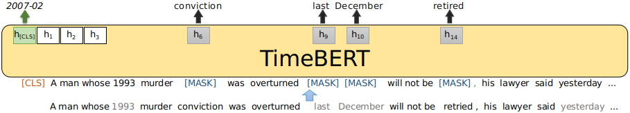

# TimeBERT
This is the repository containing the code for the TimeBERT model described in the SIGIR 2023 paper **"Extending Pre-Trained Language Representations with Dual-Type Temporal Information"**.

We introduce TimeBERT, a novel language representation model trained on a temporal collection of news articles via two new pre-training tasks, which harnesses two distinct temporal signals to construct time-aware language representations. The experimental results show that TimeBERT consistently outperforms BERT and other existing pre-trained models with substantial gains on different downstream NLP tasks and applications for which time is of importance.

  

